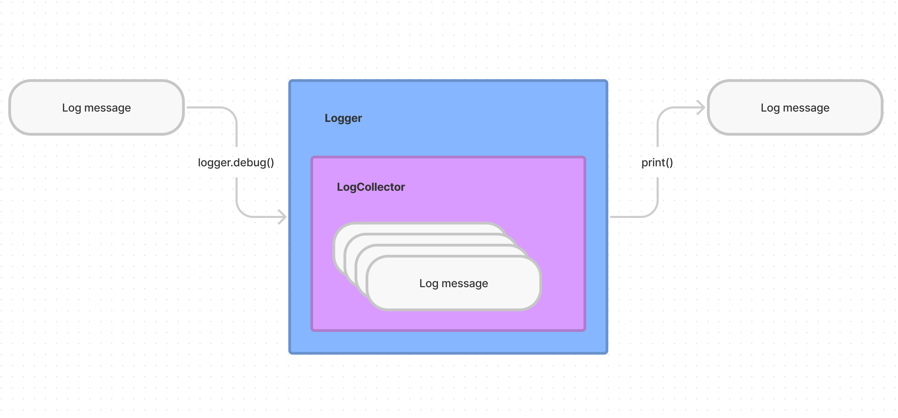

# LogKit

Just a few things to help out with logging.
 
 ## CollectingLogger
 
 When it's told to log, it will send it to the output as well as collect it in the logs collection. You pass it a `LogCollector` on initialization. The `LogCollector` will store the logs so you need to keep a reference it to.

 ```swift
 let collector = LogCollector()
 CollectingLogger(label: "Example", logCollector: collector)
 ```
Now when you want to programtically check for logs, you can use the `LogHandler`'s filter functions or directly access the entries through the `allEntries` property.

```swift
let collector = LogCollector()
var logger = CollectingLogger(label: "Example", logCollector: collector)
let value = UUID().uuidString
logger.info("\(value)")

// Then the entries will contain a message with the value
let entry = collector.logs.filter { entry in
    entry.message.contains(value)
}.first
```



## Logger.setTestName

In the setup function of your tests, use this to add the test name to the logs.
It will change the logs of `Logger.default.debug("!!! Logging debug details")`  from looking like this: 
> debug com.apple.dt.xctest.tool : !!! Logging debug details
 
into this:

> debug com.apple.dt.xctest.tool : **test=LogKitTests.testExample** !!! Logging debug details

Here is how to use it
```swift
override func setUp() {
    self.logger = Logger(label: "Example")
    logger.setTestName(self.name)
}
```
